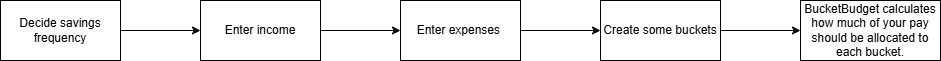
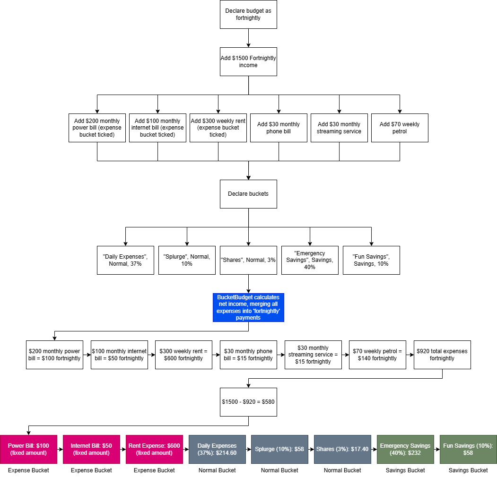

# BucketBudget

BucketBudget will help you divide your income into 3 different bucket types: normal buckets, savings buckets, and expense buckets. 

Buckets can be specific bank accounts, or just a way to help you understand what's happening with your income. You will need to declare the frequency of your budget, the income sources, any expenses, and lastly the buckets. BucketBudget will then take your income, subtract it by the expenses, and allocate your remaining income into the buckets.

Normal Buckets are general purpose percentage based buckets. Some use cases of a normal bucket are: allocating 40% towards a daily expenses bank account used for petrol/groceries, and 10% towards a 'fun' bank account used for non-essentials like pizza, coffees, games etc.

Savings Buckets work the same way as normal buckets, just with an S infront of them to indicate you shouldn't be dipping into these accounts without a good reason. For example, you might want to save 40% of your income for emergencies and 10% for holidays.

Expense Buckets work a little differently than the other two. They are fixed amount buckets that are just a normal expense. The difference is that you might have an important bill that you need to pay each month, so you want to allocate a fixed amount of your pay into the expense bucket so that you will always have enough to pay the bill. 

Here's an example of an expense bucket: You earn $500 a week and have a $200 power bill every month that must be paid. In your banking app, you decide to open a new account called 'Power bill'. You did the math and found out you can put $50 into this account every pay so that you will always have enough to pay the power bill. You then found out you can tick 'Expense Bucket' on any important expenses like this in BucketBudget, and the app will do all of that work for you.

## An easy way to figure out what to do with your money

## The full flow

Looking at the flow above, you can see that BucketBudget will automatically tell you how much money is allocated into each bucket. All you have to do is enter your income, expenses and decide the percentages.
With a fortnightly budget on a $1500 fortnightly income, BucketBudget divided the budget as so:
- $214.60 into the Daily Expenses bucket
- $58.00 into the Splurge bucket
- $17.40 into the Shares bucket
- $232.00 into the Emergency Savings bucket
- $58.00 into the Savings Fun Savings bucket

Not each bucket should necessarily be it's own bank account. For example, the $17.40 into the shares bucket might be an automatic payment you have that goes to your favourite shares app, and the expense buckets might all go into their own 'utilities' bank account, or you might have a direct debit set up from your everyday account for them.